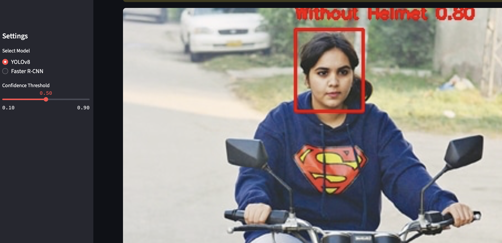

# Helmet Detection System

Система детекции шлемов на основе двух моделей:
1. YOLOv8 (ultralytics)
2. Faster R-CNN (Detectron2)

## Архитектура решения
- **Backend**: Python 3.10+
- **Интерфейс**: Streamlit
- **Модели**:
  - `Models/detectron_best.pth` - Faster R-CNN (2 класса)
  - `Models/yolov8m.pt` - YOLOv8 (2 класса)

## Установка
```bash
conda create -n helmet_detection python=3.10
conda activate helmet_detection
pip install -r requirements.txt
```

## Запуск
```bash
streamlit run app/streamlit_app.py
```

## Интерфейс
1. Выбор модели (YOLOv8 или Faster R-CNN)
2. Загрузка изображения
3. Настройка confidence threshold
4. Кнопка "Detect" для запуска детекции

## Пример работы


- Класс 0: Without Helmet (красный)
- Класс 1: With Helmet (зеленый)

## Технические детали
- Faster R-CNN конфиг: COCO-Detection/faster_rcnn_R_50_FPN_3x.yaml
- Порог детекции по умолчанию: 0.5
- Логирование в консоль:
  - Загруженные веса модели
  - Архитектура модели
  - Результаты детекции

## Требования
См. requirements.txt

## Deployment

For deployment instructions including GitHub setup and handling large model files, see [DEPLOY.md](DEPLOY.md)